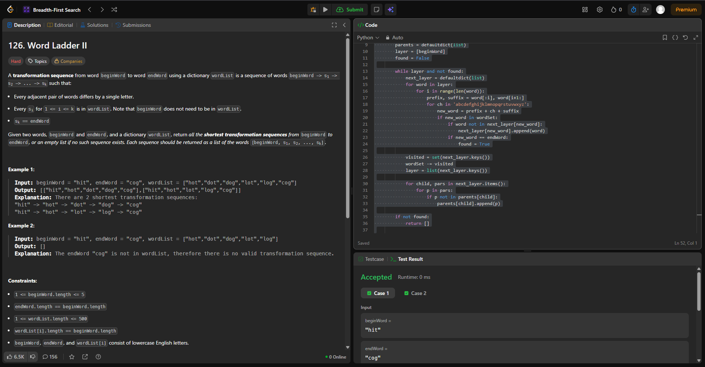
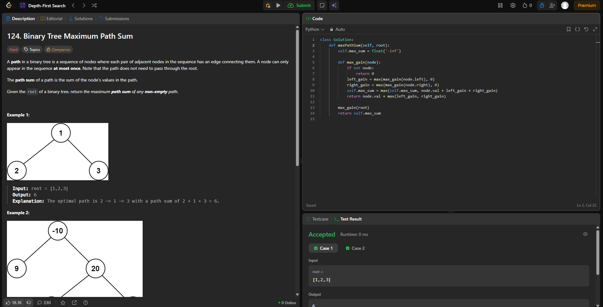

# Grafos!

**Número da Lista**: 31<br>
**Conteúdo da Disciplina**: Grafos!<br>

## Alunos
|Matrícula | Aluno |
| -- | -- |
| 211031074 | João Pedro da Silva Rodrigues |
| 221022696 | Nathan Benigno Ponce de Abreu |

## Sobre 

### Questões
| Título | Responsável | Dificuldade
| -- | -- | -- | 
|129. World Ladder II  | Nathan Abreu | Difícil  |
| 124. Binary Tree Maximum Path Sum  | Nathan Abreu | Difícil |
|329. Longest Increasing Path in a Matrix  | João Pedro | Difícil |
| 332. Reconstruct Intinerary | João Pedro | Difícil |


## Screenshots
### [(Caminho crescente mais longo em uma Matriz)](https://leetcode.com/problems/longest-increasing-path-in-a-matrix/description/?envType=problem-list-v2&envId=graph)


### [ (Reconstruindo_Intinerario)](https://leetcode.com/problems/reconstruct-itinerary/?envType=problem-list-v2&envId=graph)


### [(Word Ladder II)](https://leetcode.com/problems/word-ladder-ii/?envType=problem-list-v2&envId=breadth-first-search)



### [(Binary Tree Maximum Path Sum)](https://leetcode.com/problems/binary-tree-maximum-path-sum/description/?envType=problem-list-v2&envId=depth-first-search)




## Link do vídeo

Clique no link abaixo para ser direcionado para o vídeo: 

[(Link do Vídeo)](https://youtu.be/k1t9lX-tVLg)  


## Guia de execução


### Questão 01

rode o Python: Joao_Pedro/Longest_Increasing_Matrix.py

```
input: 
matrix = [[9,9,4],[6,6,8],[2,1,1]]
output: 
 4

```

### Questão 02

rode o Python: Joao_Pedro/Reconstruct_Intinerary.py

```
input: 
tickets = [["MUC","LHR"],["JFK","MUC"],["SFO","SJC"],["LHR","SFO"]]


output:
["JFK","MUC","LHR","SFO","SJC"]

```

### Questão 03

rode o Python: Nathan/Binary_tree_path_sum.py

```
Input: root = [1,2,3]

Output: 6

```

### Questão 04

rode o Python: Nathan/Word_ladder.py

```
Input:

beginWord ="hit"
endWord ="cog"
wordList =["hot","dot","dog","lot","log","cog"]

Output: [["hit","hot","lot","log","cog"],["hit","hot","dot","dog","cog"]]


```
## Instalação 
python instalado

**Linguagem**: Python <br>
